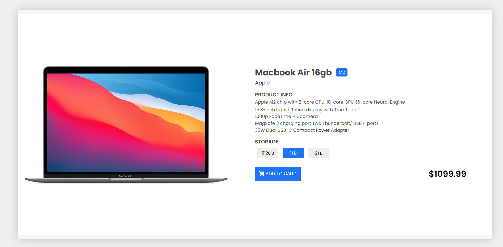
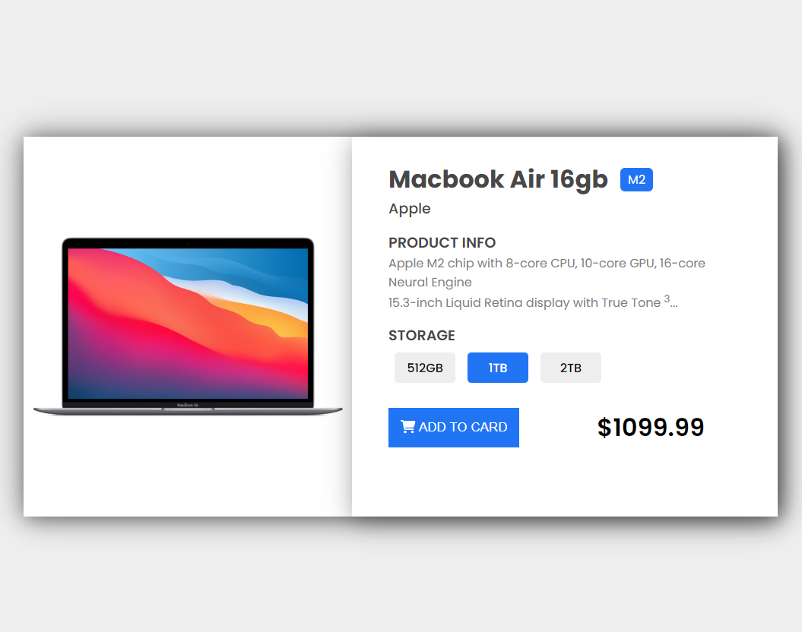

# product_card

## Project Aim
The Responsive Product Card project is a demonstration of an attractive and user-friendly 
web design for showcasing product details. 
CSS skills, including 'media queries", 'flex',  'margin', and 'padding' to create a responsive
product card interface.

### Project Page
[product card](https://zlhshn.github.io/product_card/)

 
